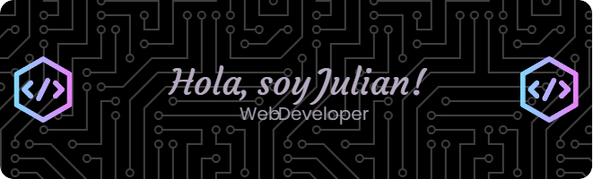

  

===============================

Web Developer / Front-End / Full-Stack
--------------------------------------

¡Hola GitHub! 👋 Soy un apasionado Desarrollador Full Stack Trainee con un amor profundo por la programación y la creación de soluciones creativas. Mi enfoque integral abarca tanto el frontend como el backend, y estoy ansioso por aplicar mis habilidades en un entorno colaborativo que fomente la innovación y el crecimiento.

*   🌍  Soy de Argentina - Cordoba - Rio Cuarto
*   🖥️  Puedes ver mi portfolio en [Mi Portfolio](http://portfoliojulian.netlify.app/)
*   ✉️  Puedes contactarme en [Correo](mailto:julianignaciobelizan@gmail.com)
*   🚀  Me encuentro trabajando en: [En busca de trabajo !](http://www.linkedin.com/in/julianbelizan/)
*   🧠  Estoy en proceso de aprendizaje de Astro - NodeJS - ExpressJS
*   🤝  Que busco?: Busco oportunidades como Programador Front-end o Programador Full-Stack, donde pueda aportar mi pasión, creatividad y habilidades para contribuir al éxito de un equipo y seguir creciendo como profesional
*   ⚡  #DesarrolladorFullStack #InnovaciónTecnológica #CrecimientoProfesional#
### Socials

 <a href="https://www.github.com/JulianBelizan" target="_blank" rel="noreferrer"> <picture> <source media="(prefers-color-scheme: dark)" srcset="https://raw.githubusercontent.com/danielcranney/readme-generator/main/public/icons/socials/github-dark.svg" /> <source media="(prefers-color-scheme: light)" srcset="https://raw.githubusercontent.com/danielcranney/readme-generator/main/public/icons/socials/github.svg" />  </picture> </a> <a href="https://www.linkedin.com/in/julianbelizan/" target="_blank" rel="noreferrer"> <picture> <source media="(prefers-color-scheme: dark)" srcset="https://raw.githubusercontent.com/danielcranney/readme-generator/main/public/icons/socials/linkedin-dark.svg" /> <source media="(prefers-color-scheme: light)" srcset="https://raw.githubusercontent.com/danielcranney/readme-generator/main/public/icons/socials/linkedin.svg" />  </picture> </a>

  
### Skills

### Frontend  

  
  
  
  
  
  
  
  
  
  

</td><td valign="top" width="33%">

### Backend  

  
  
  
  

</td><td valign="top" width="33%">

### Database  

  
  

